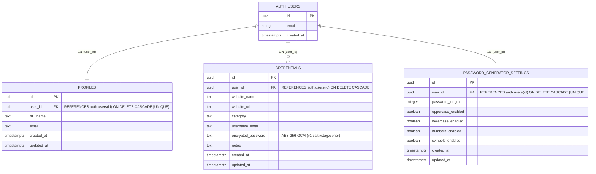

# PassVault — Final Product Documentation

## 1. Problem Statement
In today's digital landscape, users manage dozens of online accounts across education, workplace tools, e-commerce, banking, and entertainment services. 

Remembering many distinct, high-entropy passwords is cognitively challenging. Consequently, users frequently resort to insecure habits:
- Reusing identical or slightly varied passwords across multiple websites.
- Using simple, easily guessable dictionary words or predictable patterns.
- Storing unencrypted credentials in plaintext documents, browser notes, or physical notebooks.

When a single service suffers a credential breach, password reuse puts all connected user accounts at severe risk of credential stuffing and unauthorized account takeover.

---

## 2. Solution
**PassVault** is a modern, secure, and user-friendly web application designed to centralize and protect website and application login credentials in one encrypted digital vault.

PassVault enables users to:
- Safely store and manage login credentials with zero plaintext passwords in the database.
- Quickly search and filter accounts in real time.
- Reveal (Show/Hide) and 1-click copy passwords on demand.
- Organize accounts into dedicated categories (*Social, Work, Shopping, Finance, Education, Other*).
- Generate cryptographically strong random passwords using Web Crypto CSPRNG.
- Enforce complete user data isolation through PostgreSQL Row Level Security (RLS).

---

## 3. Target Users

### Primary Users
- **Students:** Managing university portals, learning management systems (Canvas, Coursera), research tools, and student email accounts.
- **Employees & Professionals:** Managing company SaaS logins, development portals (GitHub, AWS), and collaboration software.
- **Freelancers:** Managing client dashboards, invoicing platforms (Stripe), and independent project tools.
- **General Internet Users:** Managing social media, personal emails, and digital subscription services.

### Secondary Users
- **Online Shoppers:** Storing store credentials and checkout accounts securely.
- **Small Business Owners:** Organizing business utility and vendor accounts.
- **Users Transitioning from Manual Methods:** Migrating from physical notebooks, spreadsheets, or unencrypted text files.

---

## 4. Major Implemented Features

### Authentication & Session Management
- **User Registration (`/signup`):** Full name, email, password strength meter, and confirmation validation.
- **User Login (`/login`):** Supabase email/password authentication and Google OAuth provider support.
- **Password Recovery (`/forgot-password` & `/reset-password`):** Secure token-based password reset workflow.
- **Session Logout & Auto-Lock:** Instant session teardown, local state clearance, and inactivity auto-lock.
- **Route Protection:** Global guard (`AppLayout.tsx`) intercepting unauthenticated visits to private vault routes.

### Password Vault (CRUD)
- **Add Credential (`/vault/new`):** Validated inputs for Website Name, URL, Category, Username/Email, Password, and Notes.
- **View Credentials (`/vault`):** Responsive grid/card views with masked passwords (`••••••••`).
- **Credential Details (`/vault/[id]`):** Metadata timestamps, website launcher, and on-demand decryption.
- **Edit Credential (`/vault/[id]/edit`):** In-place modification updating database timestamps.
- **Delete Credential:** Protected deletion flow requiring explicit confirmation in a modal dialog.

### Search & Organization
- **Real-Time Search (`/search` & Topbar):** Multi-attribute search across website names, URLs, and usernames.
- **Category Filtering:** 6 category chips (*Social, Work, Shopping, Finance, Education, Other*) + *All* filter.
- **Combined Querying:** Simultaneous keyword search and category filtering.

### Cryptographic Password Generator (`/generator`)
- **CSPRNG Generation:** Built on `window.crypto.getRandomValues`.
- **Customizable Options:** Length slider (6 to 48 characters) and toggles for Uppercase, Lowercase, Numbers, and Symbols.
- **Strength Evaluation:** Real-time entropy evaluation meter and color-coded strength classification.
- **"Use Password" Action:** Transfers generated password directly into the credential creation form.

### User Experience & Security
- **Design System:** Midnight Black (`#070A10`), Dark Charcoal (`#111827`), Electric Blue (`#2563EB`), Plus Jakarta Sans typography.
- **Reversible AES-256-GCM Encryption:** Passwords encrypted on the server before storage in PostgreSQL (`v1:salt:iv:authTag:ciphertext`).
- **Loading & Empty States:** Skeleton loaders, empty vault guides, and empty search illustrations.

---

## 5. Technology Stack

| Layer | Technology | Role in PassVault |
|---|---|---|
| **Frontend Framework** | Next.js 16 (React 19, App Router) | Server-side rendering, API route handlers, and component lifecycle management. |
| **Language** | TypeScript | Strict compile-time type safety across data contracts and UI props. |
| **Styling** | Tailwind CSS | Responsive styling adhering to the Midnight Black & Electric Blue design system. |
| **Backend & Auth** | Supabase | Authentication engine, session listener, and secure client APIs. |
| **Database** | PostgreSQL | Relational database engine with indexes, foreign keys, and cascading deletes. |
| **Security & Authorization** | Row Level Security (RLS) | Database-level policy enforcement ensuring `auth.uid() = user_id`. |
| **Cryptography** | Node.js Crypto / Web Crypto API | Reversible AES-256-GCM encryption with server-side master key isolation. |
| **Deployment** | Vercel | Cloud edge deployment with automated CI/CD and secure environment variable injection. |
| **Source Control** | GitHub | Git repository management and version history tracking. |

---

## 6. Database Structure & Entity-Relationship Diagram (ERD)

* **User Ownership:** All records reference `auth.users(id)` as foreign key with `ON DELETE CASCADE`.
* **Row Level Security:** Enabled on all tables. Policies restrict `SELECT`, `INSERT`, `UPDATE`, and `DELETE` strictly to `auth.uid() = user_id`.

---

## 7. Testing Summary

### Functional Testing
- **Sign Up / Login / Logout:** Verified with input validation and session tracking.
- **CRUD Operations:** Verified Add, View, Edit, and Delete with modal confirmation.
- **Show/Hide & Copy:** Verified on-demand decryption and 2-second clipboard feedback.
- **Search & Category Filter:** Verified multi-field fuzzy matching and category pill filtering.
- **Password Generator:** Verified CSPRNG randomness and "Use in Form" transfer.

### UI & Responsive Testing
- Verified on Desktop ($>1024\text{px}$), Tablet ($640\text{px}–1024\text{px}$), and Mobile ($<640\text{px}$) with zero horizontal scrolling.

### Error Testing
- Verified error handling for empty required fields, mismatched passwords, invalid URLs, and unauthorized route access.

### User Testing (3 Real Users)
| User | Feedback | Changes Required |
|---|---|---|
| **User 1** | *Pending — actual user testing required* | *Pending* |
| **User 2** | *Pending — actual user testing required* | *Pending* |
| **User 3** | *Pending — actual user testing required* | *Pending* |

---

## 8. Real Challenges Encountered & Solutions

1. **PowerShell UTF-8 BOM Encoding Issue:**
   - *Challenge:* Default PowerShell file output wrote UTF-8 with Byte Order Mark (`\uFEFF`), which caused Turbopack and Tailwind CSS parser errors in `tsconfig.json` and `globals.css`.
   - *Solution:* Standardized file creation using `[System.Text.UTF8Encoding]($false)` to enforce clean, BOM-free UTF-8 files.

2. **Server-Side Encryption Key Isolation:**
   - *Challenge:* Passwords needed to be stored encrypted in PostgreSQL while preventing the master encryption key from ever being exposed to browser client JavaScript or `NEXT_PUBLIC_*` variables.
   - *Solution:* Implemented dedicated server-side Next.js route handlers (`/api/vault/encrypt` and `/api/vault/decrypt`) using Node.js `crypto` with AES-256-GCM. The key resides strictly in server environment variables (`ENCRYPTION_KEY`).

3. **React 19 Next.js Dynamic Route Parameter Unwrapping:**
   - *Challenge:* Next.js 16 with React 19 treats `params` as a `Promise<{ id: string }>` in dynamic routes (`/vault/[id]` and `/vault/[id]/edit`).
   - *Solution:* Used React 19's `use(params)` hook to unwrap asynchronous route parameters cleanly.

4. **Empty Generator Character Pool Edge Case:**
   - *Challenge:* A user unchecking all four character toggles in the password generator could produce an empty character pool.
   - *Solution:* Implemented a resilient fallback in `lib/generator.ts` defaulting to lowercase + uppercase + numeric characters if all toggles are disabled.

---

## 9. Future Improvements — Version 2 Roadmap

The following features are planned for future major releases:
1. **Browser Extension:** Chrome, Firefox, and Edge extensions with automatic form detection.
2. **Autofill & Auto-Save:** One-click credential autofill and modal prompts to save newly registered accounts.
3. **Subscription & Billing System:** Tiered plans (Free Trial, Monthly Pro, Annual Pro) with Stripe integration.
4. **Advanced Security Reports & Breach Alerts:** HaveIBeenPwned API integration for compromised password warnings.
5. **AI Password Assistant:** Local LLM assistant for password health analysis and duplicate detection.
